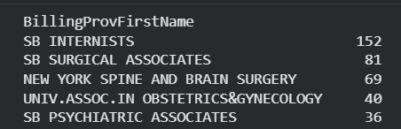
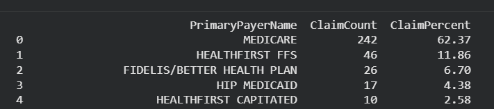
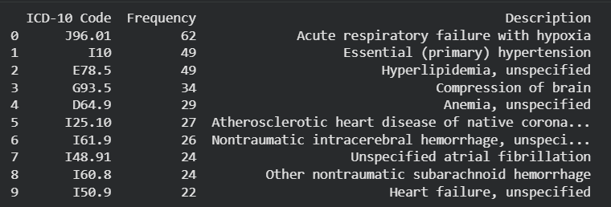
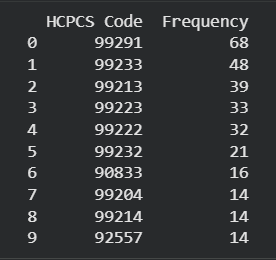
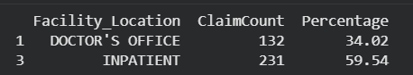
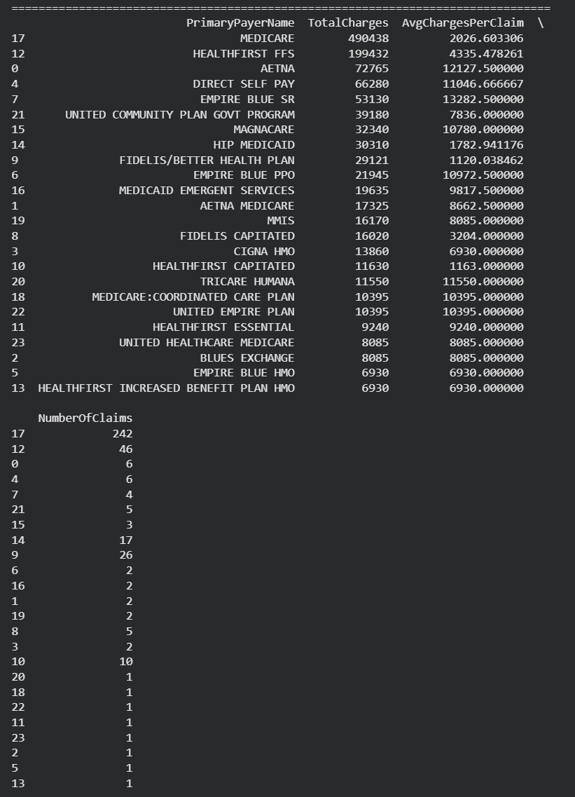

# Claims Analysis Project

## 1. Project Description
This project simulates real-world healthcare claims analysis performed by data analysts, medical billing specialists, and health informaticians. Using prospective claims data from **Stony Brook University Hospital (May 2024)**, the analysis focuses on:

- Revenue cycle management  
- Coding accuracy audits  
- Payer contract analysis  
- Clinical quality reporting  
- Healthcare operations optimization  

The notebook demonstrates how to work with relational healthcare data, perform multi-table joins, and generate insights into provider billing patterns, payer mix, diagnoses, and procedures.

---

## 2. Data Source
The dataset consists of three interconnected CSV files forming a relational structure:

- **HEADER File** (`STONYBRK_20240531_HEADER.csv`)  
  Claim-level information (providers, payer, service dates, place of service).  

- **LINE File** (`STONYBRK_20240531_LINE.csv`)  
  Service line details (procedure codes, modifiers, charges, units).  

- **CODE File** (`STONYBRK_20240531_CODE.csv`)  
  Diagnosis codes (ICD-10).  

> Data files are stored locally in `data/` but excluded from GitHub via `.gitignore`.

---

## 3. How to Run the Notebook (Google Colab)
1. Open the notebook directly in Google Colab:  
   - Navigate to `notebooks/claims_analysis.ipynb` in this repository.  
   - Click **"Open in Colab"** (or upload manually to Colab).  

2. Upload the raw CSV files into the `data/` folder of the repository.  
   - Use the Colab file browser (left sidebar → Files → Upload) to place the files in `/content/data/`.  
   - Ensure the following files are present in the `data/` folder:  
     - `STONYBRK_20240531_HEADER.csv`  
     - `STONYBRK_20240531_LINE.csv`  
     - `STONYBRK_20240531_CODE.csv`  

3. Install required libraries (if not already available in Colab):  
   ```python
   !pip install -r requirements.txt
   ```

4. Run all cells in `claims_analysis.ipynb` to reproduce the analysis.

---

## 4. Summary of Key Findings
- **Top Billing Providers**: Identified the 5 providers with the highest claim volumes.  


- **Payer Mix**: Revealed the top 5 insurance payers and their percentage share of claims.  


- **Common Diagnoses & Procedures**: Highlighted the 10 most frequent ICD-10 diagnosis codes and CPT/HCPCS procedure codes.  
  


- **Service Location Trends**: Compared inpatient vs. doctor’s office claims distribution.  


- **Charges by Payer**: Ranked payers by total charges, average charges per claim, and claim volume.  


---

## 5. Required Libraries
- pandas – Data loading, cleaning, and relational joins  
- numpy – Numerical operations  
- matplotlib – Data visualization (bar charts, pie charts)  
- seaborn – Enhanced statistical visualizations 